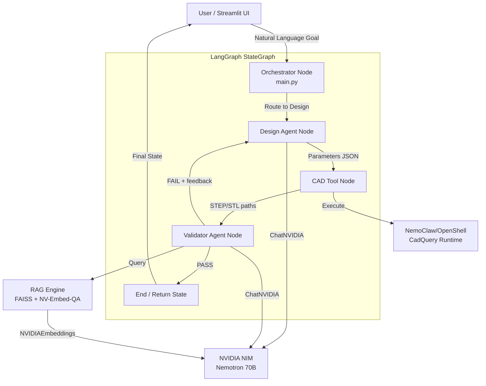
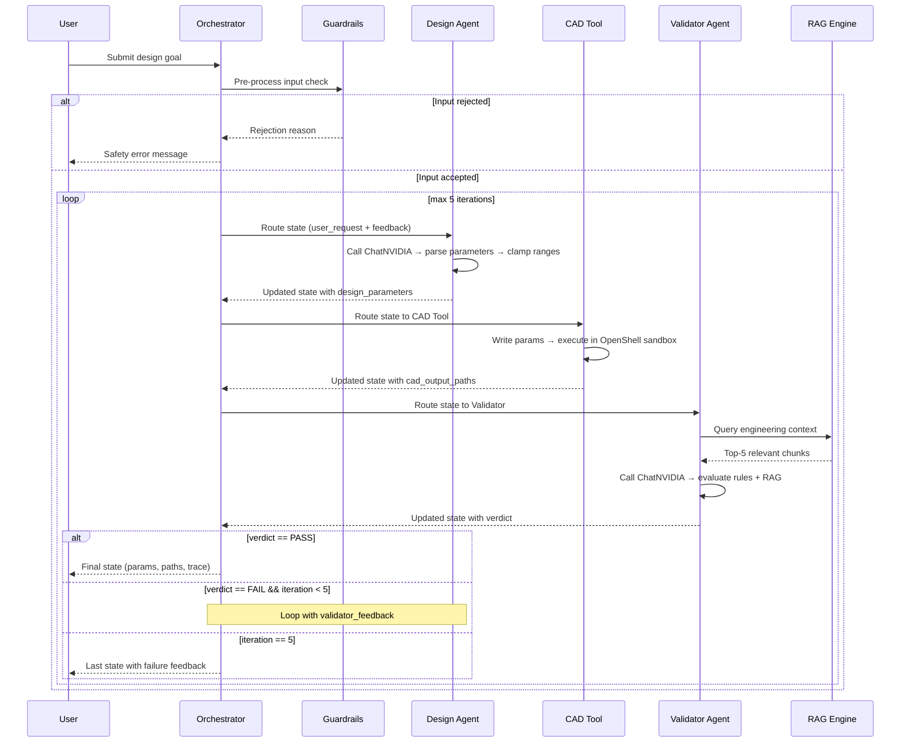
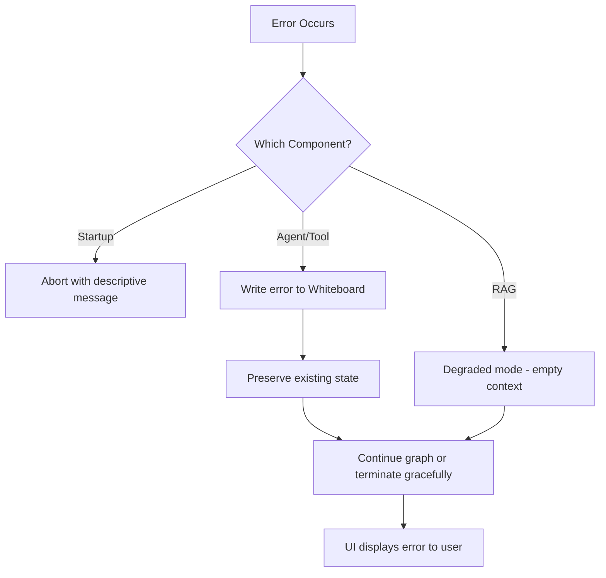

# Design Document: NemoClaw Virtual Twin Companion

## Overview

The NemoClaw Virtual Twin Companion is a multi-agent engineering AI system that enables conversational parametric CAD design of quadcopter drone chassis. The system uses a LangGraph StateGraph orchestrator to coordinate two specialized agents — a Design Agent and a Validator Agent — which iteratively translate natural-language design goals into optimized 3D geometry.

The architecture follows the whiteboard state pattern: a shared state dictionary flows between graph nodes, accumulating design parameters, validation results, and agent traces. All LLM inference uses NVIDIA NIM via `langchain-nvidia-ai-endpoints`, all embeddings use NVIDIA Nemotron Embed, and CAD execution is sandboxed in NemoClaw/OpenShell.

### Key Design Decisions

1. **Whiteboard State Pattern over Message Passing**: Agents communicate through a shared mutable state dictionary rather than direct message passing. This enables deterministic routing, full observability, and iteration without complex message queues.

2. **Iterative Convergence Loop (max 5 iterations)**: The Design→CAD→Validate cycle repeats until validation passes or hits a ceiling, preventing infinite loops while allowing design refinement.

3. **YAML-driven configuration**: All prompts, model selections, and tool parameters are externalized to YAML so the system is tunable without code changes.

4. **Sandboxed CAD execution**: CadQuery scripts run inside NemoClaw/OpenShell to prevent LLM-generated parameter values from compromising the host system.

5. **Degraded-mode tolerance**: Every external dependency (RAG, NVIDIA API, sandbox) has a fallback path so the system never crashes from a single component failure.

## Architecture

### High-Level System Diagram



### Iteration Flow



## Components and Interfaces

### 1. Orchestrator (`main.py`)

**Responsibility**: Define, compile, and execute the LangGraph StateGraph. Manage routing logic and iteration control.

```python
# --- High-Level Design ---
# Node: orchestrator_entry
# Reads: user_request
# Writes: agent_trace (append)
# Routes to: design_agent_node

from langgraph.graph import StateGraph, END
from typing import TypedDict, List, Optional

class WhiteboardState(TypedDict):
    user_request: str
    design_parameters: Optional[dict]
    validator_feedback: Optional[str]
    iteration_count: int
    cad_output_paths: Optional[List[str]]
    agent_trace: List[dict]
    validator_verdict: Optional[str]
    validator_score: Optional[float]
    error: Optional[str]

def build_graph() -> StateGraph:
    """
    Construct and compile the LangGraph StateGraph.

    Args:
        None

    Returns:
        StateGraph: Compiled graph ready for invocation.

    Component: Orchestrator
    """
    graph = StateGraph(WhiteboardState)
    graph.add_node("guardrails", guardrails_node)
    graph.add_node("design_agent", design_agent_node)
    graph.add_node("cad_tool", cad_tool_node)
    graph.add_node("validator_agent", validator_agent_node)

    graph.set_entry_point("guardrails")
    graph.add_conditional_edges("guardrails", route_after_guardrails)
    graph.add_edge("design_agent", "cad_tool")
    graph.add_edge("cad_tool", "validator_agent")
    graph.add_conditional_edges("validator_agent", route_after_validation)

    return graph.compile()

def route_after_guardrails(state: WhiteboardState) -> str:
    """
    Route to design_agent if input passes guardrails, else END.

    Args:
        state (WhiteboardState): Current graph state.

    Returns:
        str: Next node name or END.

    Component: Orchestrator
    """
    if state.get("error"):
        return END
    return "design_agent"

def route_after_validation(state: WhiteboardState) -> str:
    """
    Route back to design_agent on FAIL (if under iteration limit), else END.

    Args:
        state (WhiteboardState): Current graph state.

    Returns:
        str: "design_agent" for retry or END for termination.

    Component: Orchestrator
    """
    if state.get("validator_verdict") == "PASS":
        return END
    if state.get("iteration_count", 0) >= 5:
        return END
    return "design_agent"

def run_graph(user_request: str) -> WhiteboardState:
    """
    Public entry point to invoke the agent pipeline.

    Args:
        user_request (str): The user's natural-language design goal.

    Returns:
        WhiteboardState: Final state after graph execution completes.

    Component: Orchestrator
    """
    initial_state: WhiteboardState = {
        "user_request": user_request,
        "design_parameters": None,
        "validator_feedback": None,
        "iteration_count": 0,
        "cad_output_paths": None,
        "agent_trace": [],
        "validator_verdict": None,
        "validator_score": None,
        "error": None,
    }
    compiled = build_graph()
    return compiled.invoke(initial_state)
```

### 2. Guardrails Node

**Responsibility**: Pre-process user input using NeMo Agent Toolkit safety checks before routing to agents.

```python
def guardrails_node(state: WhiteboardState) -> WhiteboardState:
    """
    Apply NeMo Agent Toolkit Guardrails to user input.

    Args:
        state (WhiteboardState): Current graph state with user_request.

    Returns:
        WhiteboardState: State with error populated if input is blocked.

    Component: Orchestrator
    """
    user_input = state.get("user_request", "")
    
    # NeMo Agent Toolkit guardrails check
    is_safe, rejection_reason = check_guardrails(user_input)
    
    if not is_safe:
        state["error"] = f"Input blocked by safety guardrails: {rejection_reason}"
        state["agent_trace"].append({
            "node": "guardrails",
            "action": "REJECTED",
            "reason": rejection_reason
        })
    else:
        state["agent_trace"].append({
            "node": "guardrails",
            "action": "PASSED"
        })
    
    return state
```

### 3. Design Agent (`agents/design_agent.py`)

**Responsibility**: Convert natural-language design goals + validator feedback into clamped parametric values.

```python
# --- Low-Level Design ---
# Key functions and their signatures:

class DesignAgent:
    PARAM_RANGES = {
        "arm_length": (80.0, 200.0),
        "material_thickness": (2.0, 10.0),
        "arm_width": (8.0, 25.0),
        "center_cutout_radius": (10.0, 30.0),
    }
    DEFAULTS = {
        "arm_length": 120.0,
        "material_thickness": 5.0,
        "arm_width": 15.0,
        "center_cutout_radius": 20.0,
    }

    def clamp_parameters(self, params: dict) -> dict:
        """
        Clamp all parameter values to their defined min/max ranges.

        Args:
            params (dict): Raw parameters from LLM output.

        Returns:
            dict: Parameters with each value clamped to [min, max].

        Component: Design_Agent
        """
        clamped = {}
        for key, (lo, hi) in self.PARAM_RANGES.items():
            val = float(params.get(key, self.DEFAULTS[key]))
            clamped[key] = max(lo, min(hi, val))
        return clamped

    def enforce_structural_constraint(self, params: dict) -> dict:
        """
        Enforce arm_width >= arm_length * 0.08.

        Args:
            params (dict): Clamped design parameters.

        Returns:
            dict: Parameters with arm_width increased if necessary.

        Component: Design_Agent
        """
        min_width = params["arm_length"] * 0.08
        if params["arm_width"] < min_width:
            params["arm_width"] = min(min_width, self.PARAM_RANGES["arm_width"][1])
        return params

    def invoke(self, state: WhiteboardState) -> WhiteboardState:
        """
        Main LangGraph node entry point.

        Args:
            state (WhiteboardState): Shared graph state.

        Returns:
            WhiteboardState: Updated state with design_parameters and trace.

        Component: Design_Agent
        """
        # If user_request is empty/missing, return defaults immediately
        if not state.get("user_request", "").strip():
            state["design_parameters"] = self.DEFAULTS.copy()
            return state

        # Build prompt, call ChatNVIDIA, parse JSON
        raw_params = self._call_llm(state)
        clamped = self.clamp_parameters(raw_params)
        final = self.enforce_structural_constraint(clamped)
        
        state["design_parameters"] = final
        state["iteration_count"] = state.get("iteration_count", 0) + 1
        state["agent_trace"].append({
            "node": "design_agent",
            "action": "GENERATED_PARAMS",
            "parameters": final,
            "iteration": state["iteration_count"]
        })
        return state
```

### 4. Validator Agent (`agents/validator_agent.py`)

**Responsibility**: Evaluate design parameters against engineering rules and RAG-retrieved context. Produce a PASS/FAIL verdict with structured feedback.

```python
class ValidatorAgent:
    STRUCTURAL_RULE = lambda self, p: p["arm_width"] >= p["arm_length"] * 0.08
    MANUFACTURABILITY_RULE = lambda self, p: p["material_thickness"] >= 2.0

    def invoke(self, state: WhiteboardState) -> WhiteboardState:
        """
        Evaluate design parameters and produce validation verdict.

        Args:
            state (WhiteboardState): Shared graph state with design_parameters.

        Returns:
            WhiteboardState: Updated state with verdict, score, feedback.

        Component: Validator_Agent
        """
        params = state["design_parameters"]
        issues = []
        suggestions = []

        # Rule-based checks
        if not self.STRUCTURAL_RULE(params):
            issues.append("Structural: arm_width < arm_length * 0.08")
            min_w = params["arm_length"] * 0.08
            suggestions.append(f"Increase arm_width to at least {min_w:.1f} mm")

        if not self.MANUFACTURABILITY_RULE(params):
            issues.append("Manufacturability: material_thickness < 2.0 mm (FDM minimum)")
            suggestions.append("Increase material_thickness to at least 2.0 mm")

        # RAG-based evaluation
        rag_context = self._query_rag(params)
        rag_assessment = self._llm_evaluate(params, rag_context, issues)

        # Determine verdict
        verdict = "FAIL" if issues or rag_assessment.get("critical_issues") else "PASS"
        score = self._compute_score(params, issues, rag_assessment)

        state["validator_verdict"] = verdict
        state["validator_score"] = score
        state["validator_feedback"] = json.dumps({
            "verdict": verdict,
            "score": score,
            "issues": issues + rag_assessment.get("issues", []),
            "suggestions": suggestions + rag_assessment.get("suggestions", []),
            "reasoning": rag_assessment.get("reasoning", "")
        })
        state["agent_trace"].append({
            "node": "validator_agent",
            "action": "EVALUATED",
            "verdict": verdict,
            "score": score
        })
        return state

    def _query_rag(self, params: dict) -> list:
        """
        Query RAG engine for relevant engineering context.

        Args:
            params (dict): Current design parameters for context formulation.

        Returns:
            list: Top-5 document chunks or empty list on failure.

        Component: Validator_Agent
        """
        try:
            from tools.rag_engine import RAGEngine
            engine = RAGEngine()
            query = (
                f"drone chassis arm_length={params['arm_length']}mm "
                f"thickness={params['material_thickness']}mm structural requirements"
            )
            return engine.query(query)
        except Exception:
            return []

    def _compute_score(self, params: dict, issues: list, rag_assessment: dict) -> float:
        """
        Compute a 0.0-1.0 confidence score.

        Args:
            params (dict): Design parameters.
            issues (list): Rule-based issues found.
            rag_assessment (dict): LLM evaluation results.

        Returns:
            float: Score between 0.0 and 1.0.

        Component: Validator_Agent
        """
        base = 1.0
        base -= len(issues) * 0.2
        base -= len(rag_assessment.get("issues", [])) * 0.1
        return max(0.0, min(1.0, base))
```

### 5. CAD Tool (`tools/cad_tool.py`)

**Responsibility**: Write design parameters into `master_drone_template.py` and execute it inside NemoClaw/OpenShell sandbox.

```python
class CADTool:
    def invoke(self, state: WhiteboardState) -> WhiteboardState:
        """
        Execute CAD generation in NemoClaw/OpenShell sandbox.

        Args:
            state (WhiteboardState): Shared state with design_parameters.

        Returns:
            WhiteboardState: Updated state with cad_output_paths or error.

        Component: CAD_Tool

        Architecture Note:
            Unlike mesh-based geometry (Blender, PyVista), this tool uses
            parametric BREP (Boundary Representation) via CadQuery — the same
            mathematical kernel approach as Dassault CATIA/3DEXPERIENCE.
            BREP preserves exact geometry (curves, surfaces) whereas mesh
            approximates with triangles. This matters for manufacturing
            tolerances and downstream CAM toolpath generation.
        """
        params = state["design_parameters"]

        # Validate parameter ranges before execution
        validation_errors = self._validate_ranges(params)
        if validation_errors:
            state["error"] = f"Parameter validation failed: {validation_errors}"
            state["agent_trace"].append({
                "node": "cad_tool",
                "action": "VALIDATION_FAILED",
                "errors": validation_errors
            })
            return state

        # Write parameters into the template script
        script_content = self._inject_parameters(params)

        # --- NEMOCLAW_OPENSHELL EXECUTION START ---
        # Execute inside NemoClaw/OpenShell sandbox
        success, output = self._execute_in_sandbox(script_content)
        # --- NEMOCLAW_OPENSHELL EXECUTION END ---

        if success:
            state["cad_output_paths"] = [
                "optimized_drone_chassis.step",
                "optimized_drone_chassis.stl"
            ]
            state["agent_trace"].append({
                "node": "cad_tool",
                "action": "GENERATED",
                "outputs": state["cad_output_paths"]
            })
        else:
            state["error"] = f"CAD execution failed: {output}"
            state["agent_trace"].append({
                "node": "cad_tool",
                "action": "EXECUTION_FAILED",
                "reason": output
            })
        return state

    def _validate_ranges(self, params: dict) -> list:
        """
        Validate all parameters fall within defined bounds.

        Args:
            params (dict): Design parameters to validate.

        Returns:
            list: List of validation error strings, empty if all valid.

        Component: CAD_Tool
        """
        errors = []
        ranges = {
            "arm_length": (80.0, 200.0),
            "material_thickness": (2.0, 10.0),
            "arm_width": (8.0, 25.0),
            "center_cutout_radius": (10.0, 30.0),
        }
        for key, (lo, hi) in ranges.items():
            val = params.get(key)
            if val is None or val < lo or val > hi:
                errors.append(f"{key}={val} outside [{lo}, {hi}]")
        return errors

    def _execute_in_sandbox(self, script_content: str) -> tuple:
        """
        Execute script in NemoClaw/OpenShell with 60-second timeout.

        Args:
            script_content (str): Complete Python/CadQuery script content.

        Returns:
            tuple: (success: bool, output_or_error: str)

        Component: CAD_Tool
        """
        # NemoClaw/OpenShell execution stub
        # In production, this calls the NVIDIA sandbox API
        pass
```

### 6. RAG Engine (`tools/rag_engine.py`)

**Responsibility**: Ingest PDFs, build/load FAISS vector store, serve similarity queries using NVIDIA Nemotron Embed.

```python
from langchain_nvidia_ai_endpoints import NVIDIAEmbeddings

class RAGEngine:
    def __init__(self):
        """
        Initialize RAG Engine with NVIDIA embeddings and FAISS.

        Component: RAG_Engine
        """
        self.config = self._load_config()
        self.embeddings = NVIDIAEmbeddings(
            model=self.config["embedding"]["model"],
            truncate=self.config["embedding"]["truncate"]
        )
        self.vector_store = self._load_or_build_store()

    def query(self, text: str) -> list:
        """
        Retrieve top-k relevant document chunks.

        Args:
            text (str): Query text to search for.

        Returns:
            list: Top-5 chunks with text and source metadata,
                  or empty list on failure.

        Component: RAG_Engine
        """
        try:
            results = self.vector_store.similarity_search(text, k=self.config["retrieval"]["top_k"])
            return [{"text": doc.page_content, "source": doc.metadata.get("source", "")} for doc in results]
        except Exception:
            return []

    def _load_or_build_store(self):
        """
        Load persisted FAISS index or build from PDFs.

        Returns:
            FAISS: Vector store instance.

        Component: RAG_Engine
        """
        persist_dir = self.config["vector_store"]["persist_directory"]
        if os.path.exists(persist_dir):
            return FAISS.load_local(persist_dir, self.embeddings, allow_dangerous_deserialization=True)
        return self._build_from_pdfs()

    def _build_from_pdfs(self):
        """
        Ingest PDFs from data/ directory, chunk, embed, and persist.

        Returns:
            FAISS: Newly built vector store, or empty store if no PDFs found.

        Component: RAG_Engine
        """
        # Load PDFs, split by config chunk_size/overlap, embed, persist
        pass
```

### 7. Streamlit UI (`app.py`)

**Responsibility**: Provide chat interface, agent trace display, 3D viewer placeholder, and NVIDIA Riva speech stubs.

```python
import streamlit as st

def main():
    """
    Streamlit application entry point.

    Component: Streamlit_UI
    """
    st.set_page_config(page_title="NemoClaw Virtual Twin Companion", layout="wide")
    st.title("🚁 NemoClaw Virtual Twin Companion")

    # Chat history state
    if "messages" not in st.session_state:
        st.session_state.messages = []

    # Display chat history
    for msg in st.session_state.messages:
        with st.chat_message(msg["role"]):
            st.write(msg["content"])

    # Chat input
    if prompt := st.chat_input("Describe your drone design goal..."):
        st.session_state.messages.append({"role": "user", "content": prompt})
        
        with st.spinner("Designing..."):
            result = run_graph(prompt)
        
        # Display results or error
        if result.get("error"):
            st.error(result["error"])
        else:
            display_results(result)

    # Agent Trace (expandable)
    with st.expander("🔍 Agent Trace"):
        display_trace(st.session_state.get("last_trace", []))

    # 3D Viewer Placeholder
    st.subheader("🖥️ 3D Model Viewer")
    st.info("PyVista/stpyvista 3D viewer — integration pending")

    # --- NVIDIA Riva ASR Stub ---
    # Speech-to-CAD workflow: Riva ASR captures voice input,
    # transcribes to text, and feeds into the chat pipeline.
    # This enables hands-free design iteration.
    st.subheader("🎤 Voice Input (NVIDIA Riva ASR)")
    st.info("NVIDIA Riva Speech-to-Text — integration pending")

    # --- NVIDIA Riva TTS Stub ---
    # Voice feedback: Riva TTS reads back design results and
    # validator feedback audibly for multimodal interaction.
    st.subheader("🔊 Voice Output (NVIDIA Riva TTS)")
    st.info("NVIDIA Riva Text-to-Speech — integration pending")
```

## Data Models

### WhiteboardState (LangGraph Shared State)

| Key | Type | Description |
|-----|------|-------------|
| `user_request` | `str` | Natural-language design goal from user |
| `design_parameters` | `Optional[dict]` | JSON with arm_length, material_thickness, arm_width, center_cutout_radius |
| `validator_feedback` | `Optional[str]` | JSON string with verdict, score, issues, suggestions, reasoning |
| `iteration_count` | `int` | Number of design→validate cycles completed (max 5) |
| `cad_output_paths` | `Optional[List[str]]` | Paths to generated STEP and STL files |
| `agent_trace` | `List[dict]` | Chronological log of node invocations and actions |
| `validator_verdict` | `Optional[str]` | "PASS" or "FAIL" |
| `validator_score` | `Optional[float]` | 0.0 – 1.0 confidence score |
| `error` | `Optional[str]` | Error message if any step fails |

### Design Parameters Schema

```json
{
  "arm_length": { "type": "float", "unit": "mm", "min": 80.0, "max": 200.0, "default": 120.0 },
  "material_thickness": { "type": "float", "unit": "mm", "min": 2.0, "max": 10.0, "default": 5.0 },
  "arm_width": { "type": "float", "unit": "mm", "min": 8.0, "max": 25.0, "default": 15.0 },
  "center_cutout_radius": { "type": "float", "unit": "mm", "min": 10.0, "max": 30.0, "default": 20.0 }
}
```

### Validator Response Schema

```json
{
  "verdict": "PASS | FAIL",
  "score": 0.0,
  "issues": ["string"],
  "suggestions": ["string"],
  "reasoning": "string"
}
```

### Agent Trace Entry Schema

```json
{
  "node": "guardrails | design_agent | cad_tool | validator_agent",
  "action": "string",
  "timestamp": "ISO-8601",
  "...additional_fields": "varies by node"
}
```

### Configuration Schemas

**config/agents.yaml** — required top-level keys per agent:
- `name` (str), `model` (str), `system_prompt` (str), `temperature` (float), `max_tokens` (int)

**config/tools.yaml** — required top-level keys per tool:
- `name` (str), `script_path` or `embedding_model` (str), `parameters` (dict for CAD tool)

**config/rag.yaml** — required top-level keys:
- `rag_pipeline.embedding` (with `model`, `truncate`), `rag_pipeline.vector_store` (with `type`, `persist_directory`), `rag_pipeline.retrieval` (with `top_k`)


## Correctness Properties

*A property is a characteristic or behavior that should hold true across all valid executions of a system — essentially, a formal statement about what the system should do. Properties serve as the bridge between human-readable specifications and machine-verifiable correctness guarantees.*

### Property 1: Parameter Clamping Preserves Bounds

*For any* dict of four float values (including negative, zero, very large, NaN-safe), after applying `clamp_parameters`, every parameter in the output satisfies its defined range: arm_length ∈ [80.0, 200.0], material_thickness ∈ [2.0, 10.0], arm_width ∈ [8.0, 25.0], center_cutout_radius ∈ [10.0, 30.0].

**Validates: Requirements 3.2, 3.3, 3.4, 3.5**

### Property 2: Structural Constraint Enforcement

*For any* arm_length in [80.0, 200.0] and any arm_width in [8.0, 25.0], after applying `enforce_structural_constraint`, the output satisfies arm_width >= arm_length × 0.08.

**Validates: Requirements 3.9**

### Property 3: Malformed LLM Output Returns Defaults

*For any* string that does not contain a valid JSON object with all four parameter keys, `_parse_parameters` returns exactly the default values: arm_length=120.0, material_thickness=5.0, arm_width=15.0, center_cutout_radius=20.0.

**Validates: Requirements 3.7**

### Property 4: Validator Verdict Output Invariants

*For any* valid design_parameters dict (all four keys present with float values in their ranges), the Validator Agent output always contains a `verdict` in {"PASS", "FAIL"} and a `score` in [0.0, 1.0].

**Validates: Requirements 4.1**

### Property 5: Validator Rule Violation Causes FAIL

*For any* design_parameters where arm_width < arm_length × 0.08 OR material_thickness < 2.0, the Validator Agent verdict is "FAIL".

**Validates: Requirements 4.2, 4.3**

### Property 6: Validator PASS When All Rules Satisfied

*For any* design_parameters where arm_width >= arm_length × 0.08 AND material_thickness >= 2.0 AND RAG context contains no critical issues, the Validator Agent verdict is "PASS".

**Validates: Requirements 4.8**

### Property 7: FAIL Verdict Includes Actionable Feedback

*For any* design_parameters that cause a "FAIL" verdict, the validator response contains a non-empty `issues` list and a non-empty `suggestions` list, and the state is updated with `validator_verdict`, `validator_score`, and `validator_feedback` keys.

**Validates: Requirements 4.5, 4.6**

### Property 8: CAD Tool Range Validation Correctness

*For any* parameter dict, `_validate_ranges` returns a non-empty error list if and only if at least one parameter falls outside its defined bounds, and each error message identifies the specific parameter that violated its range.

**Validates: Requirements 5.6, 5.7**

### Property 9: Parameter Injection Preserves Values

*For any* valid design_parameters (all values within bounds), after injecting into the template script, the resulting script text contains the exact numeric literal for each parameter in the correct assignment line.

**Validates: Requirements 5.1**

### Property 10: Iteration Routing Correctness

*For any* WhiteboardState with validator_verdict="FAIL" and iteration_count in [0, 4], `route_after_validation` returns "design_agent". For iteration_count >= 5 or validator_verdict="PASS", it returns END.

**Validates: Requirements 1.4, 1.9**

### Property 11: Configuration Validation Error Identification

*For any* YAML content that is missing a required top-level key, the configuration validator raises an error whose message includes the name of the missing key and the file path.

**Validates: Requirements 8.6**

## Error Handling

### Error Strategy by Component

| Component | Error Source | Handling Strategy | User Impact |
|-----------|-------------|-------------------|-------------|
| Orchestrator | Missing config files | Raise descriptive error at startup with file path and expected structure. Abort. | Application fails to start with clear message |
| Orchestrator | Invalid YAML syntax | Raise error identifying file and parse failure. Abort. | Application fails to start with clear message |
| Guardrails | Blocked input | Set `error` in state, record in trace, return to UI | User sees safety rejection message |
| Design Agent | LLM response unparseable | Return default parameters (120, 5, 15, 20) | Design continues with safe defaults |
| Design Agent | Empty user_request | Return default parameters without calling LLM | Graceful no-op |
| Design Agent | NVIDIA API timeout/error | Catch exception, return defaults, log error | Design continues with safe defaults |
| CAD Tool | Parameters out of range | Reject execution, write error to Whiteboard | User sees parameter validation error |
| CAD Tool | Sandbox execution failure | Write error to state, preserve existing state | User sees execution error, no crash |
| CAD Tool | Sandbox timeout (>60s) | Write timeout error to state | User sees timeout message |
| Validator Agent | RAG engine unavailable | Proceed with built-in rules only, note in reasoning | Evaluation may be less thorough |
| RAG Engine | No PDFs in data/ | Return empty context list (degraded mode) | Validator uses rules only |
| RAG Engine | PDF parse failure | Skip file, log warning, continue with others | Partial knowledge base |
| RAG Engine | NVIDIA embedding API error | Return empty context list, log error | Validator uses rules only |
| Streamlit UI | Orchestrator error response | Display error with visual differentiation (st.error) | User sees clear error message |
| Streamlit UI | Max iterations reached | Display last state with feedback | User sees partial result with explanation |

### Error Propagation Flow



### Key Design Principles

1. **Never crash the orchestrator**: All agent and tool errors are caught and written to state, allowing graceful termination.
2. **Fail with context**: Every error message identifies what failed, why, and what the user can do.
3. **Preserve progress**: If the CAD tool fails on iteration 3, the user still sees the parameters from iterations 1-2 in the trace.
4. **Degrade gracefully**: RAG unavailability doesn't block validation — the system falls back to built-in rules.
5. **Startup-fast-fail**: Configuration errors abort immediately before any external API calls are made.

## Testing Strategy

### Testing Framework

- **Unit Tests**: `pytest` with `pytest-mock` for mocking external dependencies
- **Property Tests**: `hypothesis` (Python PBT library) — minimum 100 iterations per property
- **Integration Tests**: `pytest` with live/mocked NVIDIA API endpoints

### Property-Based Testing Configuration

Each property test uses the Hypothesis library with:
- `@given(...)` decorators for input generation
- `@settings(max_examples=100)` minimum
- Comment tag referencing the design property

Tag format: `# Feature: nemoclaw-virtual-twin-companion, Property {N}: {title}`

### Test Matrix

| Property | Target Function | Generator Strategy |
|----------|----------------|-------------------|
| P1: Clamping | `DesignAgent.clamp_parameters` | `st.floats(allow_nan=False, allow_infinity=False)` for each param |
| P2: Structural Constraint | `DesignAgent.enforce_structural_constraint` | `st.floats(min_value=80, max_value=200)` for arm_length, `st.floats(min_value=8, max_value=25)` for arm_width |
| P3: Parse Defaults | `DesignAgent._parse_parameters` | `st.text()` filtered to exclude valid JSON with all 4 keys |
| P4: Verdict Invariants | `ValidatorAgent.invoke` (mocked LLM) | `st.fixed_dictionaries` with floats in valid ranges |
| P5: Rule Violation | `ValidatorAgent` rule checks | Params where arm_width < arm_length*0.08 OR thickness < 2.0 |
| P6: PASS Correctness | `ValidatorAgent` (mocked RAG) | Params satisfying all rules |
| P7: FAIL Feedback | `ValidatorAgent` | Params violating at least one rule |
| P8: Range Validation | `CADTool._validate_ranges` | `st.fixed_dictionaries` with unconstrained floats |
| P9: Param Injection | `CADTool._inject_parameters` | Valid params within bounds |
| P10: Routing | `route_after_validation` | States with varying verdict and iteration_count |
| P11: Config Validation | Config loader | YAML dicts with randomly removed keys |

### Unit Test Coverage (Example-Based)

- Guardrails rejection path (Req 1.10)
- PASS verdict terminates graph (Req 1.5)
- Empty user_request returns defaults (Req 3.8)
- RAG degraded mode (Req 4.7, 6.6, 6.7)
- Sandbox timeout handling (Req 5.5)
- PDF parse failure skip (Req 6.8)
- Missing config file error (Req 8.5)
- Streamlit error display (Req 7.8)
- NVIDIA_API_KEY missing error (Req 2.8)

### Integration Test Coverage

- End-to-end graph execution with mocked NVIDIA API
- RAG pipeline ingest → query cycle with sample PDFs
- Config loading from actual YAML files
- Validator + RAG integration
- Design Agent prompt includes feedback on iteration > 1

### Test Organization

```
tests/
├── test_design_agent.py       # Unit + Property tests for DesignAgent
├── test_validator_agent.py    # Unit + Property tests for ValidatorAgent
├── test_cad_tool.py           # Unit + Property tests for CADTool
├── test_rag_engine.py         # Unit + Integration tests for RAGEngine
├── test_orchestrator.py       # Unit + Property tests for routing logic
├── test_config_loader.py      # Unit + Property tests for YAML validation
├── test_integration.py        # End-to-end integration tests
└── conftest.py                # Shared fixtures, mocked NVIDIA clients
```
