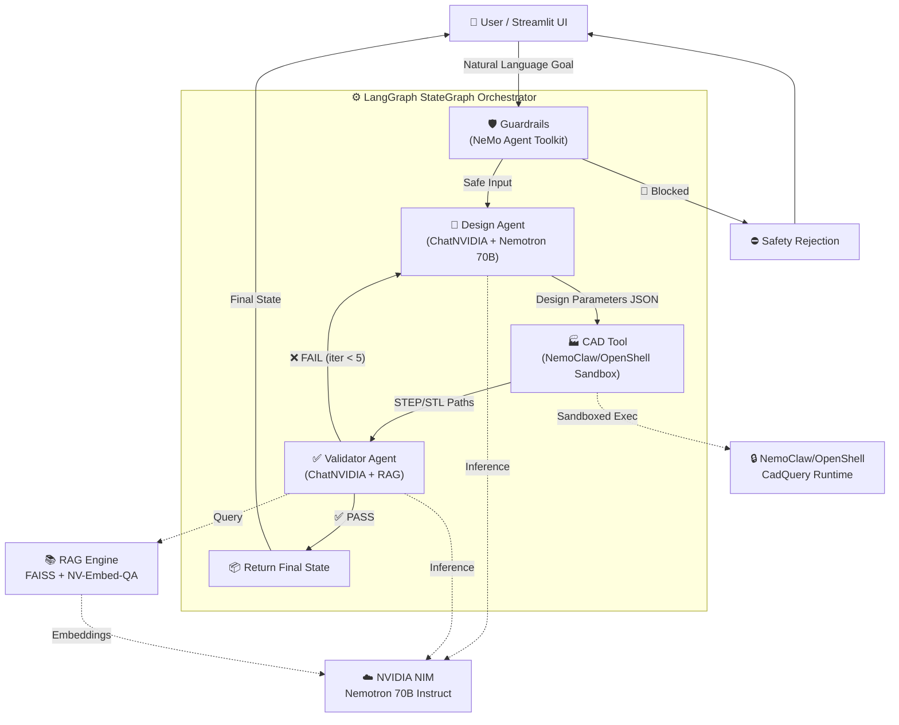

<div align="center">

# 🚁 NemoClaw Virtual Twin Companion

### Conversational Parametric CAD Design with NVIDIA Agentic AI

[](https://build.nvidia.com/)
[](https://langchain-ai.github.io/langgraph/)
[](https://streamlit.io/)
[](https://python.org/)

**A multi-agent engineering AI system that translates natural language into optimized 3D quadcopter chassis geometry — powered entirely by NVIDIA's Agentic AI stack.**

[Architecture](#-system-architecture-overview) • [NVIDIA Stack](#-nvidia-agentic-ai-stack-summary) • [Whiteboard Pattern](#-whiteboard-state-pattern) • [Getting Started](#-startup-commands) • [Configuration](#%EF%B8%8F-nvidia_api_key-configuration) • [Guardrails & Observability](#-nemo-agent-toolkit-guardrails--observability)

</div>

---

## 🏗️ System Architecture Overview

NemoClaw Virtual Twin Companion uses a **multi-agent pipeline** orchestrated by a LangGraph StateGraph. Two specialized AI agents — a Design Agent and a Validator Agent — collaborate iteratively to convert natural-language design goals into parametric 3D geometry, validated against engineering standards.

### Core Pipeline Flow

```
User → Guardrails → Design Agent → CAD Tool → Validator Agent → iterate/return
```

The system implements the **Whiteboard State Pattern**: a shared mutable state dictionary flows between graph nodes, accumulating design parameters, validation results, and agent traces. This eliminates direct agent-to-agent coupling and enables deterministic, fully observable execution.

### Architecture Diagram



### Component Interactions

| Component | Role | Communicates With |
|-----------|------|-------------------|
| **Orchestrator** (`main.py`) | Defines LangGraph StateGraph, manages routing & iteration | All components via WhiteboardState |
| **Guardrails** | Pre-processes user input for safety (keyword filtering) | Orchestrator → blocks or passes |
| **Design Agent** | Converts NL goals → parametric values via ChatNVIDIA | NVIDIA NIM (Nemotron 70B) |
| **CAD Tool** | Injects parameters into CadQuery script, executes in sandbox | NemoClaw/OpenShell runtime |
| **Validator Agent** | Evaluates designs against rules + RAG knowledge | NVIDIA NIM + RAG Engine |
| **RAG Engine** | Retrieves engineering context from PDF vector store | NVIDIA NIM (NV-Embed-QA) + FAISS |
| **Streamlit UI** (`app.py`) | Chat interface, agent trace, 3D viewer placeholder | Orchestrator `run_graph()` |

### Iteration Convergence Logic

The pipeline iterates up to **5 times** until the Validator Agent issues a PASS verdict:

1. **PASS** → Graph terminates, final state returned to UI
2. **FAIL + iterations < 5** → Validator feedback routed back to Design Agent for refinement
3. **FAIL + iterations ≥ 5** → Graph terminates with last state and failure feedback

---

## 🟢 NVIDIA Agentic AI Stack Summary

This project demonstrates comprehensive integration with NVIDIA's AI platform. **Every inference call, every embedding, and every code execution uses NVIDIA services exclusively** — zero OpenAI, Anthropic, or third-party LLM dependencies.

| Component | Role |
|-----------|------|
| **🧠 NVIDIA NIM** | Provides optimized inference microservices for Nemotron LLMs and embeddings, delivering fast and scalable AI reasoning through the `langchain-nvidia-ai-endpoints` library |
| **🔒 NemoClaw/OpenShell** | Provides enterprise-grade sandboxed execution for AI-generated CadQuery scripts, ensuring LLM-produced parametric code runs safely without compromising the host system |
| **🤖 NeMo Agent Toolkit** | Provides multi-agent orchestration patterns, state management, Guardrails (safety checks), and observability (Agent Traces) for enterprise-grade AI workflows |
| **🎙️ NVIDIA Riva** | Provides speech recognition (ASR) and text-to-speech (TTS) for multimodal interaction, enabling the Speech-to-CAD workflow for hands-free design |

### How They Connect

```
┌─────────────────────────────────────────────────────────────────┐
│  NVIDIA Agentic AI Stack — Full Integration Map                 │
├─────────────────────────────────────────────────────────────────┤
│                                                                 │
│  ┌──────────────┐    ┌───────────────────────────────────────┐  │
│  │  NVIDIA Riva │    │  NeMo Agent Toolkit                   │  │
│  │  ASR / TTS   │    │  • Guardrails (safety filtering)     │  │
│  │  (Voice I/O) │    │  • Agent Traces (observability)      │  │
│  └──────┬───────┘    │  • State Management (whiteboard)     │  │
│         │            └───────────────────┬───────────────────┘  │
│         ▼                                │                      │
│  ┌──────────────┐                        ▼                      │
│  │  Streamlit   │◄──────────── LangGraph StateGraph ────────►│  │
│  │  Chat UI     │                        │                      │
│  └──────────────┘                        │                      │
│                          ┌───────────────┼───────────────┐      │
│                          ▼               ▼               ▼      │
│                   ┌────────────┐  ┌────────────┐  ┌──────────┐  │
│                   │ NVIDIA NIM │  │ NVIDIA NIM │  │ NemoClaw │  │
│                   │ Nemotron   │  │ NV-Embed   │  │ OpenShell│  │
│                   │ 70B LLM    │  │ QA (embed) │  │ Sandbox  │  │
│                   └────────────┘  └────────────┘  └──────────┘  │
│                                                                 │
└─────────────────────────────────────────────────────────────────┘
```

---

## 📋 Whiteboard State Pattern

The **Whiteboard State Pattern** is the backbone of inter-agent communication. Instead of direct message passing, all agents read from and write to a shared `WhiteboardState` dictionary that flows through the LangGraph pipeline. This enables:

- **Deterministic routing** — edge conditions inspect state keys directly
- **Full observability** — every state mutation is traceable
- **Decoupled agents** — no agent imports or calls another agent directly
- **Iteration without complexity** — the same state dict loops back with updated feedback

### WhiteboardState Keys

| Key | Type | Written By | Read By | Description |
|-----|------|-----------|---------|-------------|
| `user_request` | `str` | UI (initial) | Guardrails, Design Agent | Natural-language design goal from the user |
| `design_parameters` | `Optional[dict]` | Design Agent | CAD Tool, Validator Agent | JSON with `arm_length`, `material_thickness`, `arm_width`, `center_cutout_radius` |
| `validator_feedback` | `Optional[str]` | Validator Agent | Design Agent (on retry) | JSON string with verdict, score, issues, suggestions, reasoning |
| `iteration_count` | `int` | Design Agent | Orchestrator (routing) | Number of design→validate cycles completed (max 5) |
| `cad_output_paths` | `Optional[List[str]]` | CAD Tool | UI, Validator Agent | Paths to generated STEP and STL geometry files |
| `agent_trace` | `List[dict]` | All Nodes | UI (Agent Trace panel) | Chronological log of node invocations and actions |
| `validator_verdict` | `Optional[str]` | Validator Agent | Orchestrator (routing) | `"PASS"` or `"FAIL"` |
| `validator_score` | `Optional[float]` | Validator Agent | UI | Confidence score between 0.0 and 1.0 |
| `error` | `Optional[str]` | Guardrails, CAD Tool | Orchestrator, UI | Error message if any step fails |

### Data Flow Between Agents

```
┌─────────────────────────────────────────────────────────────────────┐
│                    WhiteboardState Data Flow                         │
├─────────────────────────────────────────────────────────────────────┤
│                                                                     │
│  [User Input]                                                       │
│       │                                                             │
│       ▼ writes: user_request                                        │
│  ┌──────────────┐                                                   │
│  │  Guardrails  │── writes: error (if blocked), agent_trace         │
│  └──────┬───────┘                                                   │
│         │ reads: user_request                                       │
│         ▼                                                           │
│  ┌──────────────┐                                                   │
│  │ Design Agent │── reads: user_request, validator_feedback          │
│  │              │── writes: design_parameters, iteration_count,      │
│  │              │           agent_trace                              │
│  └──────┬───────┘                                                   │
│         │                                                           │
│         ▼                                                           │
│  ┌──────────────┐                                                   │
│  │   CAD Tool   │── reads: design_parameters                        │
│  │              │── writes: cad_output_paths, error, agent_trace     │
│  └──────┬───────┘                                                   │
│         │                                                           │
│         ▼                                                           │
│  ┌──────────────┐                                                   │
│  │  Validator   │── reads: design_parameters                        │
│  │    Agent     │── writes: validator_verdict, validator_score,      │
│  │              │           validator_feedback, agent_trace          │
│  └──────────────┘                                                   │
│                                                                     │
└─────────────────────────────────────────────────────────────────────┘
```

---

## 🚀 Startup Commands

### Prerequisites

- Python 3.10+
- An NVIDIA API key (free tier available at [build.nvidia.com](https://build.nvidia.com/))

### Installation

```bash
# 1. Clone the repository
git clone <repository-url>
cd NvidiaAgentHackathon

# 2. Create a virtual environment (recommended)
python -m venv venv
source venv/bin/activate        # Linux/macOS
# venv\Scripts\activate         # Windows

# 3. Install dependencies
pip install -r requirements.txt

# 4. Set your NVIDIA API key
export NVIDIA_API_KEY="nvapi-your-key-here"
# Or on Windows:
# set NVIDIA_API_KEY=nvapi-your-key-here

# 5. (Optional) Create a .env file for convenience
echo "NVIDIA_API_KEY=nvapi-your-key-here" > .env

# 6. Launch the Streamlit application
streamlit run app.py
```

### Quick Test (CLI)

```bash
# Run the orchestrator directly without the UI
python main.py
```

This executes a demo design request through the full multi-agent pipeline and prints the result to the console.

---

## 🔑️ NVIDIA_API_KEY Configuration

The system requires a single environment variable to authenticate with all NVIDIA NIM services:

```bash
export NVIDIA_API_KEY="nvapi-your-key-here"
```

Get your API key at: [https://build.nvidia.com/](https://build.nvidia.com/)

The `python-dotenv` package is integrated for local development convenience — create a `.env` file in the project root:

```env
NVIDIA_API_KEY=nvapi-your-key-here
```

If `NVIDIA_API_KEY` is not set, `ChatNVIDIA` and `NVIDIAEmbeddings` will raise a descriptive error at initialization indicating the missing key.

### NVIDIA NIM Models Used

| Model | Purpose | Component |
|-------|---------|-----------|
| `nvidia/llama-3.1-nemotron-70b-instruct` | LLM inference for design parameter generation | Design Agent |
| `nvidia/llama-3.1-nemotron-70b-instruct` | LLM inference for engineering validation & evaluation | Validator Agent |
| `NV-Embed-QA` | Vector embedding generation for RAG similarity search | RAG Engine |

All models are accessed through `langchain-nvidia-ai-endpoints`:
- **ChatNVIDIA** — LLM inference (Design Agent, Validator Agent)
- **NVIDIAEmbeddings** — Embedding generation (RAG Engine)

---

## 🛡️ NeMo Agent Toolkit Guardrails & Observability

### Guardrails — Safety Checks

The system implements **NeMo Agent Toolkit Guardrails** as a pre-processing gate on all user input. Before any agent receives a request, it passes through keyword-based safety filtering:

**What is checked:**

| Category | Examples | Action |
|----------|----------|--------|
| **Harmful Content** | hack, exploit, malware, weapon, attack, violence | Input **blocked**, error returned |
| **Off-Topic Content** | recipe, cooking, weather forecast, stock market, horoscope | Input **blocked**, error returned |
| **Empty Input** | blank strings, whitespace-only | Input **blocked**, error returned |

**How it works:**

1. User submits a design goal via chat
2. The **Guardrails node** (first node in the LangGraph StateGraph) intercepts the input
3. `check_guardrails()` scans for blocked keywords in the lowercased input
4. If blocked → sets `error` in WhiteboardState, records rejection in `agent_trace`, graph terminates via `END`
5. If safe → records "PASSED" in `agent_trace`, routes to Design Agent

**Production path:** In a full deployment, this would integrate with NVIDIA's NeMo Guardrails API for comprehensive topic control, jailbreak detection, and output filtering.

### Observability — Agent Trace

The system implements **NeMo Agent Toolkit observability patterns** through the `agent_trace` field in the WhiteboardState. Every node invocation, routing decision, and state mutation is logged for full audit visibility.

**How Agent_Trace entries are recorded:**

Each node appends a structured dict to `agent_trace` upon invocation:

```python
{
    "node": "guardrails | design_agent | cad_tool | validator_agent",
    "action": "PASSED | REJECTED | GENERATED_PARAMS | GENERATED | EVALUATED | ...",
    # Additional metadata varies by node:
    "reason": "...",           # Guardrails: rejection reason
    "parameters": {...},       # Design Agent: generated parameter values
    "iteration": 1,            # Design Agent: current iteration number
    "outputs": [...],          # CAD Tool: generated file paths
    "verdict": "PASS/FAIL",    # Validator: evaluation result
    "score": 0.85,             # Validator: confidence score
    "errors": [...]            # CAD Tool: validation errors
}
```

**Where traces are visible:**
- **Streamlit UI** — expandable "Agent Trace" panel with color-coded entries
- **Console logs** — structured logging at INFO level for every state transition
- **Final state** — the complete `agent_trace` list is returned with every `run_graph()` response

---

## 📁 Project Structure

```
NvidiaAgentHackathon/
├── main.py                    # LangGraph Orchestrator entry point
├── app.py                     # Streamlit UI entry point
├── requirements.txt           # Python dependencies (NVIDIA-exclusive)
├── master_drone_template.py   # CadQuery parametric drone chassis script
├── .env                       # NVIDIA_API_KEY (local dev, gitignored)
├── README.md                  # This file
│
├── agents/                    # AI Agent implementations
│   ├── __init__.py
│   ├── design_agent.py        # NL → parametric values (ChatNVIDIA)
│   └── validator_agent.py     # Engineering evaluation (ChatNVIDIA + RAG)
│
├── tools/                     # Tool implementations
│   ├── __init__.py
│   ├── cad_tool.py            # NemoClaw/OpenShell sandbox execution
│   └── rag_engine.py          # FAISS + NVIDIAEmbeddings RAG pipeline
│
├── models/                    # Data models and schemas
│   ├── __init__.py
│   ├── state.py               # WhiteboardState TypedDict
│   ├── parameters.py          # Design parameter ranges & defaults
│   └── validation.py          # Validator response schema
│
├── config/                    # YAML configuration (no JSON)
│   ├── agents.yaml            # Agent models, prompts, temperatures
│   ├── tools.yaml             # Tool paths and parameters
│   └── rag.yaml               # RAG pipeline configuration
│
├── data/                      # RAG source documents
│   ├── README.md              # PDF naming conventions
│   └── vectorstore/           # Persisted FAISS index (auto-generated)
│
└── tests/                     # Test suite
    ├── __init__.py
    └── conftest.py            # Shared fixtures and mocked NVIDIA stubs
```

---

## 🧪 Design Parameters

The system controls four parametric variables for quadcopter chassis generation:

| Parameter | Range (mm) | Default | Description |
|-----------|-----------|---------|-------------|
| `arm_length` | 80.0 – 200.0 | 120.0 | Distance from center to motor shaft |
| `material_thickness` | 2.0 – 10.0 | 5.0 | Z-axis frame height |
| `arm_width` | 8.0 – 25.0 | 15.0 | Y-axis arm width |
| `center_cutout_radius` | 10.0 – 30.0 | 20.0 | Center hole radius for mass reduction |

**Engineering Constraints:**
- Structural: `arm_width >= arm_length × 0.08`
- Manufacturability: `material_thickness >= 2.0 mm` (FDM minimum)

---

## 📄 License

Built for the NVIDIA India Agentic AI Open Hackathon.

---

<div align="center">

**Built with ❤️ using NVIDIA NIM • NeMo Agent Toolkit • NemoClaw/OpenShell • LangGraph • Streamlit**

</div>
